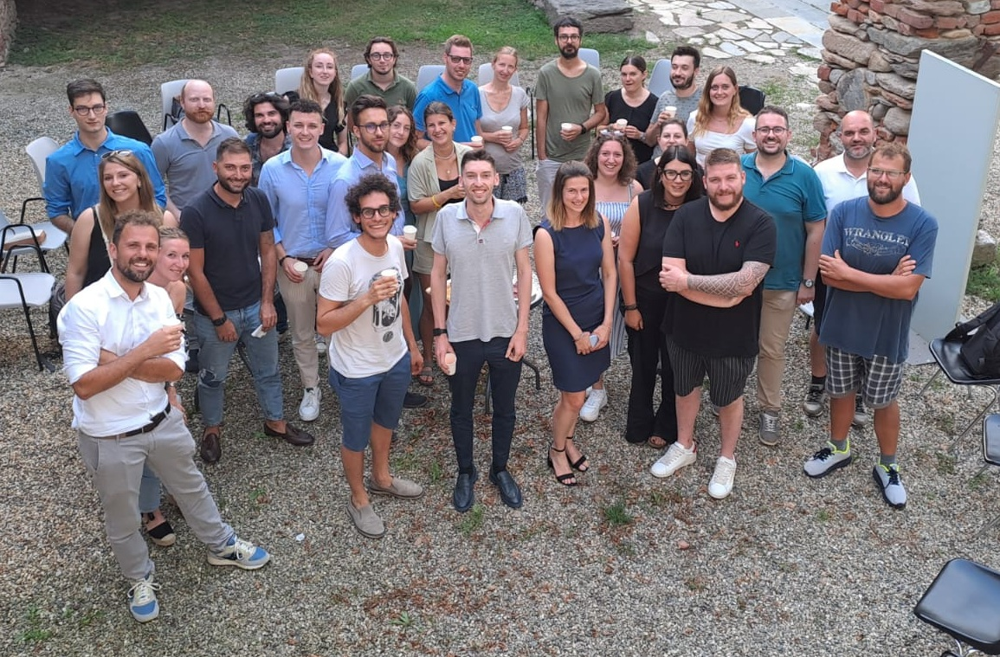

# Introduzione al progetto
Il progetto “Giovani in Comune!” ha come obiettivo principale la promozione della partecipazione attiva dei giovani (15-29 anni) e degli Amministratori Comunali Under 35 o di nuova nomina alla vita politica e sociale dei comuni del Pinerolese. Possono partecipare alla formazione anche altri cittadini/cittadine interessate e funzionari/funzionarie comunali. 

Le attività principali includono: 
- Un corso online di 6 moduli 
- Laboratori e workshop: 7 laboratori in presenza 
- Seminario residenziale: Un evento finale di due giorni con vitto e alloggio offerto a giovani cittadini, giovani amministratori, o amministratori di prima nomina dei comuni partner per consolidare le competenze e favorire il networking. 
- Coinvolgimento di amministratori e cittadini: Formazione per giovani amministratori e cittadini, facilitando la creazione di reti locali e la partecipazione alla governance

_Ente Capofila_: Comune di Vigone 

_Enti Partner_: Comuni di Airasca, Campiglione Fenile, Cavour, Cercenasco, Garzigliana, Luserna San Giovanni, Lusernetta, Macello, Osasco, Prarostino, Rorà, Scalenghe, Torre Pellice, Villafranca Piemonte, Volvera, ALI Piemonte, UNCEM Piemonte, ANPCI, ANCI Piemonte 

L’attività è realizzata con il contributo di Regione Piemonte e del Dipartimento per le Politiche giovanili e il Servizio Civile Universale – per il progetto “Partecipazione dei giovani alla vita sociale e politica dei territori” – III Edizione”. Progetto finanziato con il Fondo per le politiche giovanili.

# Materiale
### 08/02/2025 - Finanziamenti regionali, nazionali, europei
A cura dell'Ing. Stefania Mauro, Ricercatrice senior di Fondazione LINKS.

📂 [Intervento dell'Ing. Stefania Mauro](https://raw.githubusercontent.com/FedeDat/Giovani-in-Comune-2025/main/Finanziamenti%20regionali%2C%20nazionali%2C%20europei/08_02_2025_Finanziamenti%20EU_Mauro%20Stefania.pdf)
### 10/02/2025 - Processi di innovazione e pianificazione nella Pubblica Amministrazione
A cura del Dr. Michele Fatibene, Innovation Office Manager and Divisional Coordination presso Comune di Torino.

📂 [Intervento del Dr. Michele Fatibene](https://raw.githubusercontent.com/FedeDat/Giovani-in-Comune-2025/main/Processi%20di%20innovazione%20e%20pianificazione%20nella%20Pubblica%20Amministrazione/10_02_2025_Innovazione_PA_Michele_Fatibene.pdf)

📹 Registrazione disponibile tramite richiesta via email a [corsi@anci.piemonte.it](mailto:corsi@anci.piemonte.it)
### 01/03/2025 - Appalti pubblici (con focus su nuovo codice e primo correttivo)
A cura di Luciana Mellano, Responsabile Tecnico presso il Comune di Lombardore.

📂 [Intervento di Luciana Mellano](https://raw.githubusercontent.com/FedeDat/Giovani-in-Comune-2025/main/Appalti%20pubblici%20(con%20focus%20su%20nuovo%20codice%20e%20primo%20correttivo)/01_03_2025_Appalti_Luciana_Mellano.pdf)
### 13/03/2025 - Politiche di invecchiamento attivo
A cura di Katia Castellano, Responsabile Area Anziani C.I.S.S. del Pinerolese, Marcello Galletti, responsabile Servizio Innovazione e Sviluppo della Diaconia Valdese Valli, e della Dott.ssa Mara Begheldo, Esperto Welfare - Immigrazione - Politiche Abitative - ANCI Piemonte.

📂 [Intervento di Katia Castellano e Marcello Galletti](https://raw.githubusercontent.com/FedeDat/Giovani-in-Comune-2025/main/Politiche%20di%20invecchiamento%20attivo/13_03_2025_Invecchiamento_Attivo_Castellano_Galetti.pdf)

📂 [Intervento della Dott.ssa Mara Begheldo](https://raw.githubusercontent.com/FedeDat/Giovani-in-Comune-2025/main/Politiche%20di%20invecchiamento%20attivo/13_03_2025_Invecchiamento_Attivo_Mara_Begheldo.pdf)

📹 Registrazione disponibile tramite richiesta via email a [corsi@anci.piemonte.it](mailto:corsi@anci.piemonte.it)
### 05/04/2025 - Promozione del territorio
A cura della Dott.ssa Giada Armando di Turismo Torino.

📂 [Intervento della Dott.ssa Giada Armando](https://raw.githubusercontent.com/FedeDat/Giovani-in-Comune-2025/main/Promozione%20del%20territorio/05_04_2025_Turismo_Giada_Armando.pdf)
### 07/04/2025 - Etica pubblica, status e ruolo dell’Amministratore locale
A cura del Dott. Giuseppe Formichella, Segretario Generale della Città Metropolitana di Torino.

📂 [Intervento del Dott. Giuseppe Formichella](https://raw.githubusercontent.com/FedeDat/Giovani-in-Comune-2025/main/Etica%20pubblica%2C%20status%20e%20ruolo%20dell%E2%80%99Amministratore%20locale/07_04_2025_etica_trasparenza_Giuseppe%20Formichella.pdf)

📹 Registrazione disponibile tramite richiesta via email a [corsi@anci.piemonte.it](mailto:corsi@anci.piemonte.it)
### 08/05/2025 - Strumenti digitali per rappresentazione, analisi e gestione del territorio
A cura della Dott.ssa Francesca Noardo (Open GeospatialConsortium), e del Dott. Piergiorgio Cipriano (DedaNext).

📂 [Intervento della Dott.ssa Francesca Noardo](https://raw.githubusercontent.com/FedeDat/Giovani-in-Comune-2025/main/Strumenti%20digitali%20per%20rappresentazione%2C%20analisi%20e%20gestione%20del%20territorio/GiovaniStrumentiDigitali_Noardo.pdf)

📂 [Intervento del Dott. Piergiorgio Cipriano](https://raw.githubusercontent.com/FedeDat/Giovani-in-Comune-2025/main/Strumenti%20digitali%20per%20rappresentazione%2C%20analisi%20e%20gestione%20del%20territorio/GiovaniStrumentiDigitali_Cipriano.pdf)

📹 Registrazione disponibile tramite richiesta via email a [corsi@anci.piemonte.it](mailto:corsi@anci.piemonte.it)
### 10/05/2025 - Gestione del Bilancio (con menzione a contabilità accrual e concessione contributi) e processi organizzativi e contabili di enti del terzo settore

### 09/06/2025 - Cerimoniale e istituzioni pubbliche nazionali, locali e regionali
A cura del Dott. Guido Astori, responsabile Ufficio cerimoniale e relazioni istituzionali del Comune di Alessandra.
📂 [Intervento del Dott. Guido Astori](https://raw.githubusercontent.com/FedeDat/Giovani-in-Comune-2025/main/Cerimoniale%20e%20istituzioni%20pubbliche%20nazionali%2C%20locali%20e%20regionali/09_06_2025_Cerimoniale_GuidoAstori.pdf)

📹 Registrazione disponibile tramite richiesta via email a [corsi@anci.piemonte.it](mailto:corsi@anci.piemonte.it)

### 14/06/2025 - Gestione del Personale (assunzioni, obiettivi, limiti di spesa) e Welfare

### 12/07/2025 - Sviluppo urbano sostenibile

### 17/07/2025 - Ordinamento dell’ente locale, servizi pubblici locali, e potere di ordinanza 

### 26/07/2025 - Comunicazione istituzionale, internet, social media 

